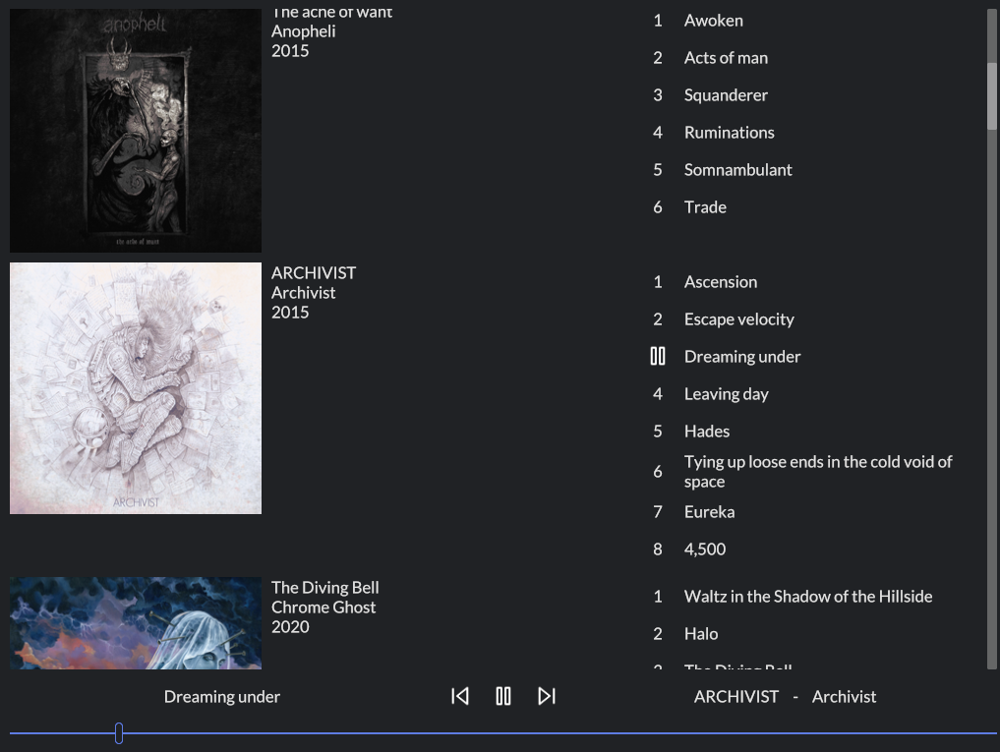

Clef is a native local music player, similar to classic iTunes or MediaMonkey. It's built on top of [Iced](https://github.com/iced-rs/iced) and [Symphonia](https://github.com/pdeljanov/Symphonia).



My goal is to make something that feels nicer to use than streaming services, to the point that I prefer to use it myself every day.

For now, only linux is fully supported. On windows, the app is usable without media controls. To build from source on linux, you'll need some native dependencies. Using apt:

```sh
sudo apt install libsqlite3-dev cmake libfontconfig1-dev
```

For development, you'll also want [just](https://github.com/casey/just), [bacon](https://dystroy.org/bacon), and diesel_cli:

```sh
cargo install diesel_cli --no-default-features --features sqlite
```

To add diesel migrations, you'll need to copy .env.example to .env, and potentially modify it for your platform.
