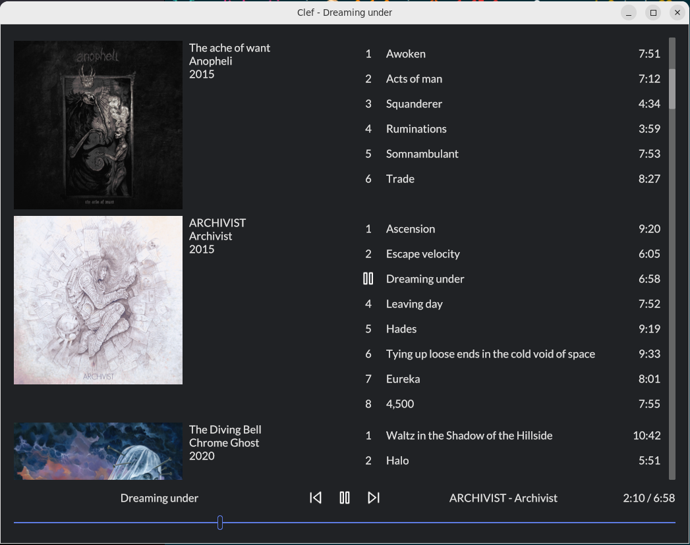

Clef is a native local music player, similar to classic iTunes or MediaMonkey. It's built on top of [Iced](https://github.com/iced-rs/iced) and [Symphonia](https://github.com/pdeljanov/Symphonia).



Windows and (ubuntu-ish) linux are supported. It might work on other platforms and it might not.
To build from source on linux, you'll need some native dependencies. Using apt:

```sh
sudo apt install libsqlite3-dev cmake libfontconfig1-dev
```

For development, you'll also want
[just](https://github.com/casey/just),
[bacon](https://dystroy.org/bacon), and
[diesel_cli](https://crates.io/crates/diesel_cli):

```sh
cargo install just
cargo install --locked bacon
cargo install diesel_cli --no-default-features --features sqlite
```

On windows, it can be easier to have diesel_cli use bundled sqlite than install your own copy:

```sh
cargo install diesel_cli --no-default-features --features "sqlite-bundled"
```

To add diesel migrations, you'll need to copy .env.example to .env. On windows, the DATABASE_URL needs to be set manually.
